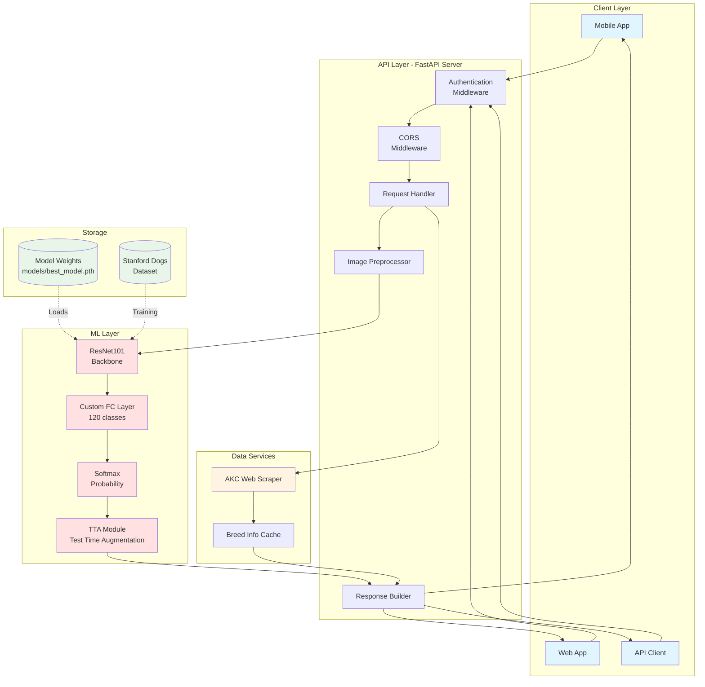
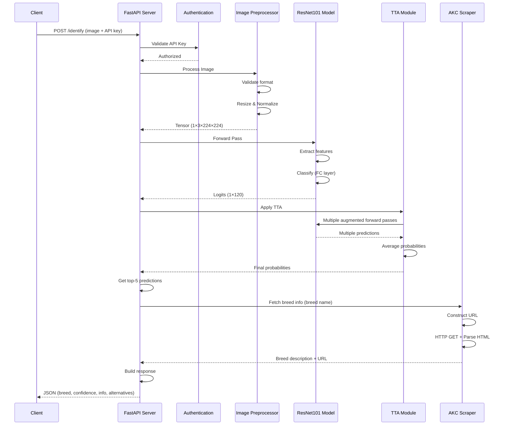
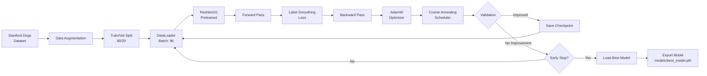

# PetSnap System Architecture

This document describes the architecture and design of the PetSnap dog breed recognition system.

## Table of Contents
- [System Overview](#system-overview)
- [Architecture Diagram](#architecture-diagram)
- [Component Details](#component-details)
- [Data Flow](#data-flow)
- [Technology Stack](#technology-stack)
- [Deployment Architecture](#deployment-architecture)

## System Overview

PetSnap is a three-tier architecture consisting of:
1. **Client Layer**: Mobile/web applications that capture or upload dog images
2. **API Layer**: FastAPI server that handles requests, authentication, and orchestration
3. **ML Layer**: ResNet101 neural network for breed classification
4. **Data Layer**: AKC web scraping service for breed information

## Architecture Diagram



## Component Details

### 1. Client Layer

**Purpose**: User interface for image capture and breed identification

**Components**:
- **Mobile Applications**: Native iOS/Android apps or cross-platform (React Native, Flutter)
- **Web Applications**: Browser-based interface for desktop users
- **API Clients**: Direct API integration for third-party applications

**Features**:
- Image capture via camera
- Image upload from gallery
- Display prediction results
- Show breed information and confidence scores
- Error handling and user feedback

### 2. API Layer (FastAPI Server)

**Purpose**: Central orchestration layer for request handling and security

**Key Components**:

#### Authentication Middleware
- **Type**: Bearer token authentication
- **Mechanism**: API key validation via `X-API-Key` header or Bearer token
- **Default Key**: `77ffda4c` (configurable via environment variable)
- **Protection**: All `/predict*` and `/identify*` endpoints require authentication

#### CORS Middleware
- **Configuration**: Allow all origins (configurable for production)
- **Purpose**: Enable mobile and web app cross-origin requests
- **Methods**: All HTTP methods allowed
- **Headers**: Custom headers supported

#### Request Handler
- **Framework**: FastAPI (async/await support)
- **Validation**: Pydantic models for request/response validation
- **Error Handling**: HTTP exception handling with appropriate status codes
- **File Upload**: Multipart form data support for image uploads

#### Image Preprocessor
- **Validation**: Content type checking, file size limits
- **Format Conversion**: RGB conversion for all images
- **Transformations**:
  - Resize to 256×256
  - Center crop to 224×224
  - Normalization (ImageNet mean/std)
  - Tensor conversion

#### Response Builder
- **Format**: JSON responses
- **Content**: Predictions, confidence scores, breed information
- **Top-K**: Returns top 5 predictions with probabilities

### 3. ML Layer

**Purpose**: Deep learning inference for breed classification

**Architecture**:

#### ResNet101 Backbone
```
Input: 3×224×224 RGB image
↓
Conv2D (7×7, stride 2)
↓
MaxPool (3×3, stride 2)
↓
4 Residual Blocks:
  - Block 1: 3 layers (256 channels)
  - Block 2: 4 layers (512 channels)
  - Block 3: 23 layers (1024 channels)
  - Block 4: 3 layers (2048 channels)
↓
Global Average Pooling
↓
Fully Connected (2048 → 120)
↓
Softmax
↓
Output: 120 class probabilities
```

**Key Features**:
- **Transfer Learning**: Initialized with ImageNet weights
- **Fine-Tuning**: All layers trained on Stanford Dogs dataset
- **Regularization**: Label smoothing (0.1), weight decay (1e-4)
- **Optimization**: AdamW optimizer with cosine annealing

#### Test Time Augmentation (TTA)
- **Purpose**: Improve prediction accuracy by averaging multiple augmented versions
- **Augmentations**:
  - Original image
  - Horizontal flips (random)
  - Multiple augmented versions (3 augmentations)
- **Aggregation**: Average softmax probabilities
- **Performance**: ~1-2% accuracy improvement

### 4. Data Services

#### AKC Web Scraper
**Purpose**: Fetch detailed breed information from American Kennel Club

**Process**:
1. **URL Construction**: Map breed name to AKC URL format
2. **HTTP Request**: Fetch page with appropriate headers
3. **HTML Parsing**: Extract breed descriptions using BeautifulSoup
4. **Fallback Strategies**:
   - Strategy 1: Look for share modal content
   - Strategy 2: Extract from JSON in script tags
   - Strategy 3: Parse main content paragraphs
5. **Cleaning**: Remove extra whitespace, limit text length
6. **Error Handling**: Return fallback message if scraping fails

**Breed Name Mappings**:
- Handles special cases (e.g., "shih-tzu", "wire-haired-fox-terrier")
- URL normalization (spaces to hyphens, lowercase)
- 30+ predefined mappings for common edge cases

#### Response Caching (Future Enhancement)
- Cache breed information to reduce scraping overhead
- TTL-based expiration
- In-memory or Redis-based storage

### 5. Storage Layer

#### Model Weights
- **File**: `models/best_model.pth`
- **Size**: ~170 MB (ResNet101 parameters)
- **Format**: PyTorch state dict
- **Loading**: Lazy loading on server startup

#### Training Dataset
- **Source**: Stanford Dogs Dataset
- **Location**: `./Images/`
- **Structure**: 120 breed folders, ~170 images per breed
- **Total Size**: ~750 MB
- **Usage**: Training and class name extraction

## Data Flow

### Inference Pipeline



### Training Pipeline (Offline)



## Technology Stack

### Backend
- **Framework**: FastAPI 0.100+
- **ASGI Server**: Uvicorn
- **Python**: 3.8+

### Machine Learning
- **Framework**: PyTorch 2.0+
- **Vision**: torchvision 0.15+
- **Image Processing**: Pillow (PIL)
- **Data Augmentation**: torchvision.transforms, AutoAugment

### Data Processing
- **Web Scraping**: BeautifulSoup4, requests
- **Numerical**: NumPy
- **Metrics**: scikit-learn
- **Visualization**: Matplotlib

### Security
- **Authentication**: Bearer token / API key
- **CORS**: FastAPI CORS middleware
- **Input Validation**: Pydantic models

## Deployment Architecture

### Current Setup (Development)
```
┌─────────────────────────────────────┐
│   Local Machine / Development       │
│                                     │
│   ┌─────────────────────────┐      │
│   │  FastAPI Server         │      │
│   │  Port: 8000             │      │
│   │  Workers: 1             │      │
│   └─────────────────────────┘      │
│              │                      │
│              ▼                      │
│   ┌─────────────────────────┐      │
│   │  PyTorch Model          │      │
│   │  Device: CUDA/CPU       │      │
│   └─────────────────────────┘      │
└─────────────────────────────────────┘
```

### Production Deployment (Recommended)

```
┌─────────────────────────────────────────────┐
│              Load Balancer                   │
│           (NGINX / AWS ALB)                  │
└─────────────────┬───────────────────────────┘
                  │
        ┌─────────┴──────────┐
        ▼                    ▼
┌───────────────┐    ┌───────────────┐
│  API Server 1 │    │  API Server 2 │
│  (Container)  │    │  (Container)  │
└───────┬───────┘    └───────┬───────┘
        │                    │
        └──────────┬─────────┘
                   ▼
        ┌──────────────────────┐
        │   Model Inference    │
        │   (GPU Server)       │
        │   NVIDIA Tesla/A100  │
        └──────────────────────┘
                   │
                   ▼
        ┌──────────────────────┐
        │   Redis Cache        │
        │   (Breed Info)       │
        └──────────────────────┘
```

**Components**:
1. **Load Balancer**: Distribute requests across multiple API servers
2. **API Servers**: Stateless FastAPI containers (horizontal scaling)
3. **GPU Server**: Dedicated inference server with CUDA support
4. **Redis Cache**: Cache breed information to reduce scraping overhead
5. **Monitoring**: Prometheus + Grafana for metrics and alerting

### Cloud Deployment Options

#### Option 1: AWS
- **Compute**: EC2 GPU instances (g4dn.xlarge or p3.2xlarge)
- **Container**: ECS with Fargate or EKS
- **Storage**: S3 for model weights
- **Load Balancer**: Application Load Balancer (ALB)
- **Cache**: ElastiCache (Redis)

#### Option 2: Google Cloud Platform
- **Compute**: Compute Engine with GPU (NVIDIA T4 or A100)
- **Container**: Cloud Run or GKE
- **Storage**: Cloud Storage for model weights
- **Load Balancer**: Cloud Load Balancing
- **AI Platform**: Vertex AI for managed inference

#### Option 3: Azure
- **Compute**: NC-series VMs (GPU enabled)
- **Container**: Azure Container Instances or AKS
- **Storage**: Blob Storage for model weights
- **Load Balancer**: Azure Load Balancer
- **AI Services**: Azure Machine Learning for deployment

## Performance Considerations

### Latency
- **Image Preprocessing**: ~50-100ms
- **Model Inference**: ~100-200ms (GPU) / ~1-2s (CPU)
- **TTA (3 augmentations)**: ~300-600ms (GPU)
- **AKC Scraping**: ~1-3s (first request), cached afterwards
- **Total End-to-End**: ~2-4s per request

### Optimization Strategies
1. **Model Quantization**: Reduce model size and inference time
2. **ONNX Runtime**: Export to ONNX for optimized inference
3. **Batch Inference**: Process multiple images together
4. **Result Caching**: Cache predictions for identical images
5. **CDN for Model**: Serve model weights from CDN
6. **Async Scraping**: Non-blocking AKC information fetching

### Scalability
- **Horizontal Scaling**: Add more API server replicas
- **Vertical Scaling**: Use larger GPU instances
- **Model Serving**: TorchServe or TensorFlow Serving
- **Queue-Based**: RabbitMQ/Celery for async processing
- **Auto-Scaling**: Scale based on request rate and GPU utilization

## Security Architecture

### Authentication Flow
```
Client Request
    ↓
Extract API Key from header
    ↓
Validate against stored key(s)
    ↓
Grant/Deny access
    ↓
Continue with request processing
```

### Security Best Practices
1. **API Key Rotation**: Regular key rotation mechanism
2. **Rate Limiting**: Prevent abuse (e.g., 100 requests/minute per key)
3. **HTTPS Only**: Enforce TLS/SSL in production
4. **Input Sanitization**: Validate all user inputs
5. **CORS Configuration**: Restrict origins in production
6. **Logging**: Audit logs for security monitoring
7. **Model Protection**: Prevent model extraction attacks

## Monitoring and Observability

### Metrics to Track
- **Request Rate**: Requests per second
- **Latency**: p50, p95, p99 response times
- **Error Rate**: 4xx and 5xx error percentages
- **Model Accuracy**: Online accuracy monitoring
- **GPU Utilization**: Memory and compute usage
- **Cache Hit Rate**: Breed info cache effectiveness

### Logging
- **Application Logs**: Request/response, errors, warnings
- **Model Logs**: Prediction confidence, top-5 classes
- **Performance Logs**: Latency breakdown by component
- **Security Logs**: Authentication attempts, failures

## Disaster Recovery

### Backup Strategy
- **Model Checkpoints**: Regular backups to S3/Cloud Storage
- **Configuration**: Version control for all configs
- **Training Data**: Archived dataset versions

### High Availability
- **Multi-Region Deployment**: Deploy in multiple AWS regions
- **Health Checks**: Liveness and readiness probes
- **Auto-Recovery**: Automatic container restart on failure
- **Graceful Degradation**: Return cached/default responses on errors

---

For implementation details, see [DESIGN_DECISIONS.md](DESIGN_DECISIONS.md).
For future improvements, see [FUTURE_WORK.md](FUTURE_WORK.md).
